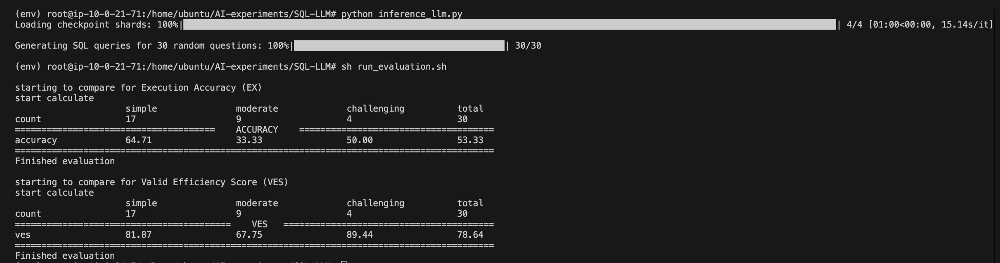

# SQL Query Generation Using LLM

This project demonstrates the generation of SQL queries from real data using the **Meta-Llama-3.1-8B-Instruct** Large Language Model (LLM) downloaded from Hugging Face. The model has been quantized to 4-bit precision to optimize memory usage.

> **Note:** To use this model, you have to apply for access. You can do so from [here](https://huggingface.co/meta-llama/Meta-Llama-3.1-8B-Instruct).


## My Approach

Instead of fine-tuning the model, I created a pipeline to extract important information from the data and pass it to the LLM. This approach helps in generating accurate SQL queries without the need for model fine-tuning.


## Prerequisites

Before you begin, ensure you have met the following requirements:

### 1. Python 3.10 is installed.
### 2. `pip` is available for package management.
### 3. **Hardware Requirements:**
  - **GPU Memory:** Approximately 11 GB (for the quantized 4-bit version of Meta-Llama-3.1-8B-Instruct)
  - **System Memory:** Approximately 4 GB
  I used an AWS `g5.xlarge` instance with an A10G GPU for this project.

### 4. Download the Open-Source LLM (**Meta-Llama-3.1-8B-Instruct**)

- **I. Install Hugging Face CLI

Install the Hugging Face command line interface (CLI) for managing models:

```bash
pip install -U "huggingface_hub[cli]"
```

- **II. Login to Hugging Face

Authenticate to Hugging Face using your access token:

```bash
huggingface-cli login
```

> **Note:** Use your own Hugging Face read token during login. You can find your access token by going to [Hugging Face Tokens](https://huggingface.co/settings/tokens).

- **III. Download the LLM from Hugging Face:

```bash
huggingface-cli download meta-llama/Meta-Llama-3.1-8B-Instruct --local-dir Meta-Llama-3.1-8B-Instruct --local-dir-use-symlinks False
```


## Setup Instructions

### 1. Create a Virtual Environment

First, create a virtual environment to manage your project dependencies:

```bash
python3 -m venv env
```

### 2. Activate the Virtual Environment

Activate the virtual environment:

- **For Linux/MacOS:**

    ```bash
    source env/bin/activate
    ```

- **For Windows:**

    ```bash
    .\env\Scripts\activate
    ```

### 3. Install Required Packages

Install the necessary packages using the `requirements.txt` file:

```bash
pip install -r requirements.txt
```


## Generate SQL queries using the downloaded LLM (Meta-Llama-3.1-8B-Instruct)

Run the Inference Script to generate SQL queries for 30 random questions from Bird Benchmark’s [dev dataset](https://bird-bench.github.io/):

```bash
python inference_llm.py
```

The generated data will be saved [here](./predicted/predict_dev.json).


## Evaluating Generated Queries

You can evaluate the efficiency of the generated SQL queries using the evaluation scripts:

- **Evaluation:**

    ```bash
    sh ./run_evaluation.sh
    ```

    The main evaluation files for this are located at `./evaluation.py` & `./evaluation_ves.py`.

> **Note:** Important Paths for Evaluation

  To run the evaluation script, ensure the following paths are correctly set:
  
  - **Databases Path:** `f"./data/dev_databases/{db_name}/{db_name}.sqlite"` (where `db_name` is the database name)
  - **Sample Data Path:** `"./data/dev_sample.json"`
  - **Extracted Original SQL Queries File Path:** `"./data/dev_gold.sql"`
  - **Predicted SQL Queries File Path:** `"./predicted/predict_dev.json"`
  
  You don't have to worry about these settings as they are already configured in `inference_llm.py`.


## Benchmarking Results

I ran and evaluated the model leveraging Bird Benchmark’s [dev dataset](https://bird-bench.github.io/). I chose 30 random questions and generated results several times. The performance metrics are as follows:

- **Execution Accuracy (EX):** Between 40% and 65%
- **Valid Efficiency Score (VES):** Between 40% and 80%

### Screenshot of Benchmark Results

Below is a screenshot of one run for your reference:




## Contact

If you face any issues or have questions, feel free to contact me at:

- **Email:** nilavoboral@gamil.com

